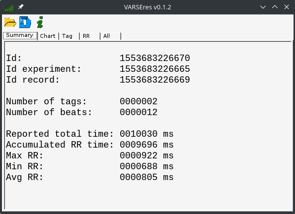
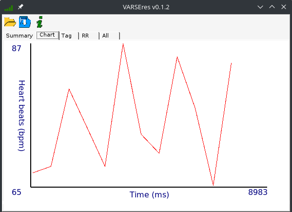

# VARSEres

## Introduction

[VARSE](http://milegroup.github.io/varse) is a tool developed for analyzing the heart beat variations in response to multimedia stimula.

## Description

This is a desktop tool that allows you to evaluate the raw data obtained after an experiment has been carried out.

It shows you a summary of the results obtained, raw rr values, tags, the corresponding graph, and the raw data directly obtained from the result file.

The graph for a given result, showing the variation of heart beats over time.

